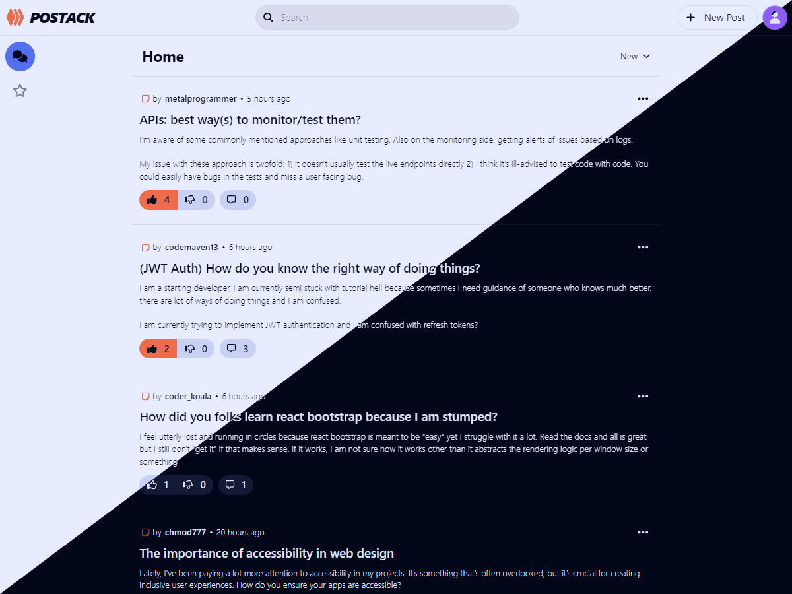
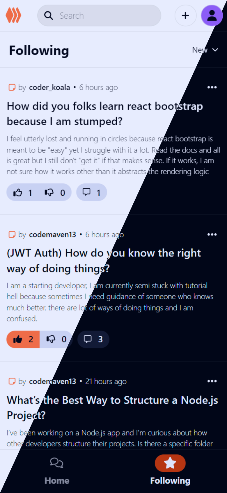
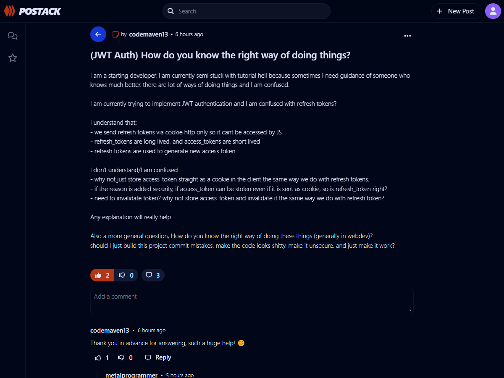
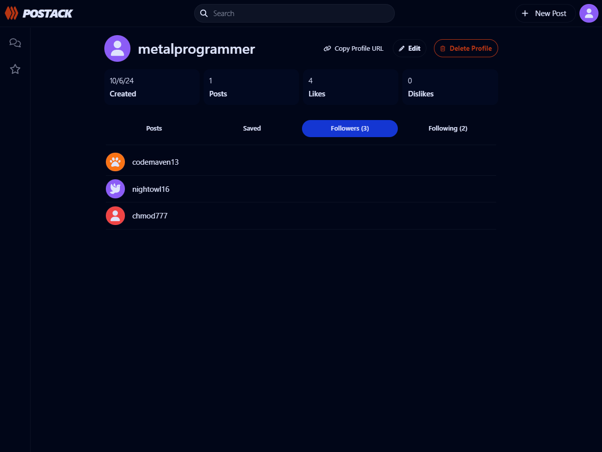
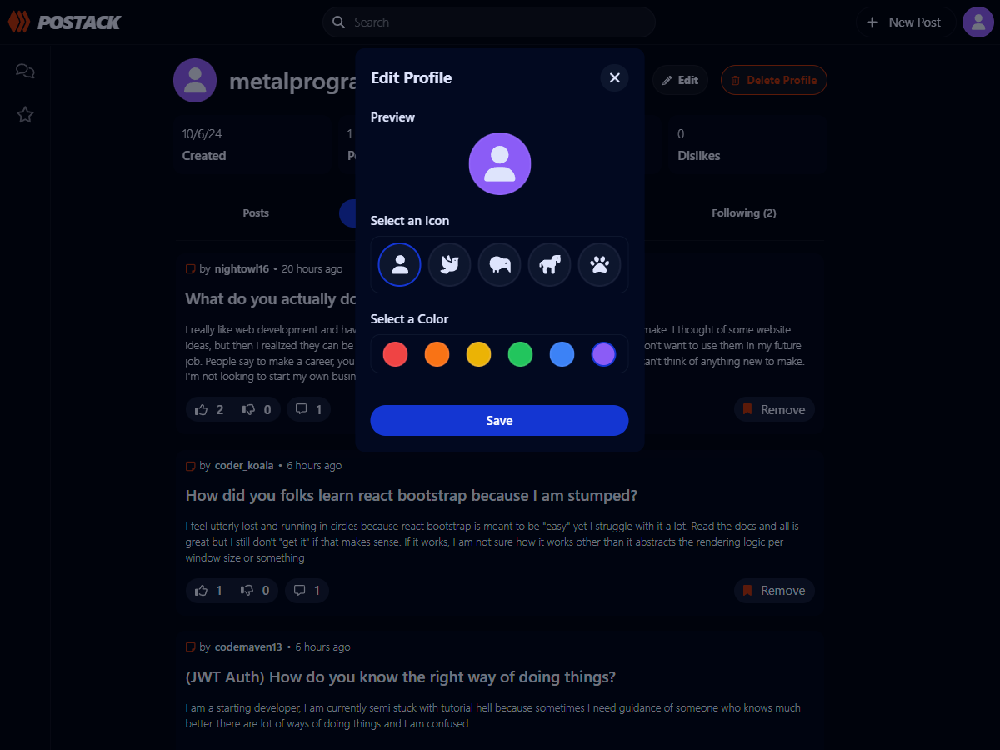

# Postack

## Description

This project is a forum application built using the MERN stack, allowing users to share, post, comment, and reply on threads.

---

## Features

### User Management

-   User Authentication: Secure sign up and log in functionality.
-   Profile Customization: Personalize user profiles with custom avatars and themes.
-   Follow Users: Stay updated by following other users.

### Content Interaction

-   Create Posts: Users can create posts, which others can interact with by:
    -   Liking and Disliking posts.
    -   Commenting on posts.
    -   Replying to comments.
-   Delete Posts, Comments, and Replies: Users can delete their own posts, comments, and replies.

### Post Management

-   Save Posts: Users can save posts to their profile for easy access later.

### Additional Features

-   Dark Mode: Supports a dark theme for better viewing comfort.

---

## Installation

1. Clone the repository: `git clone https://github.com/username/postack.git`
2. Navigate to the project directory: `cd postack`
3. Install dependencies: `npm install`
4. In one terminal navigate to frontend: `cd frontend`
5. Run the frontend: `npm run dev`
6. In the other terminal navigate to backend: `cd backend`
7. Run the backend: `npm run dev`
8. Visit localhost in browser: `http://localhost:5173/`

---

## Usage

1. Create an account or log in.
2. Create a new post or join an existing post discussion.
3. Like, dislike, comment, or reply on comments in posts.

---

## Screenshots

### Home

### Following (Mobile)

### Post

### Profile

### Profile Customization

---

## Technologies

### Frontend

-   React (including React DOM, React Router DOM)
-   Axios
-   Font Awesome
-   Moment.js
-   Vite
-   Tailwind CSS

### Backend

-   Express
-   Mongoose
-   Passport (with Passport Local)
-   Connect-Mongo
-   CORS
-   Express Async Handler
-   Express Session

---

## License

This project is licensed under the MIT License.
