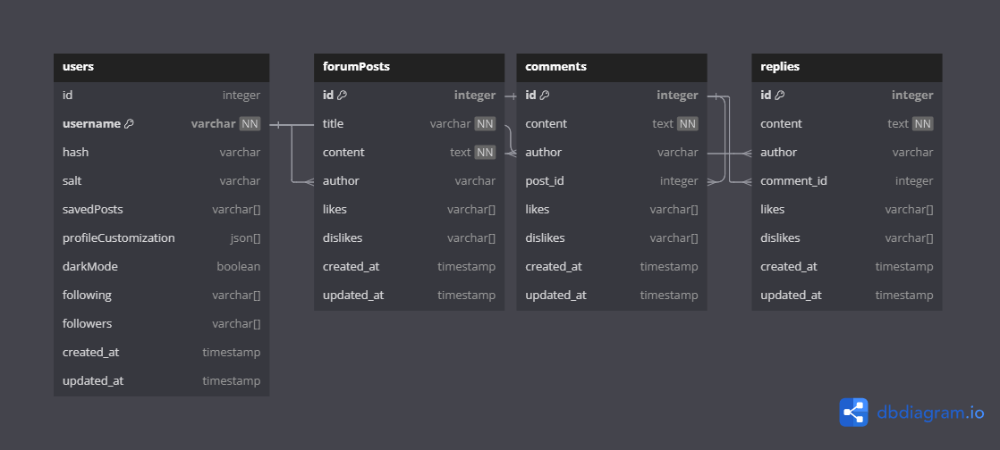
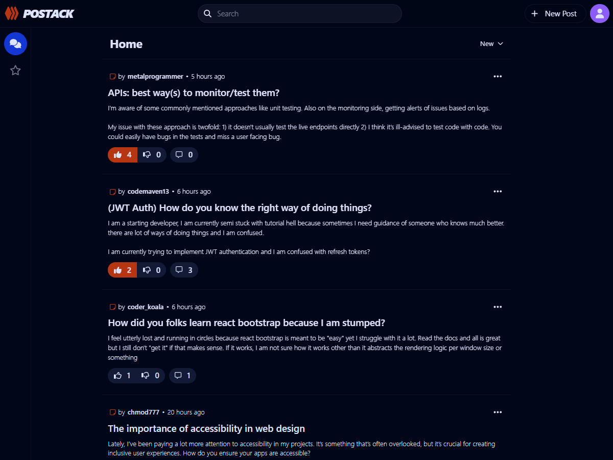
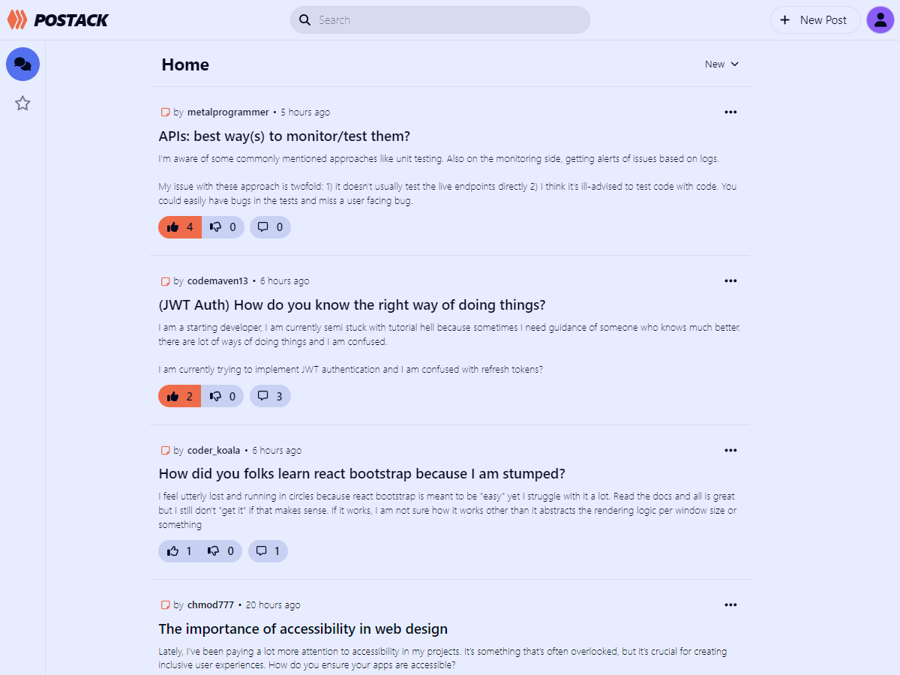
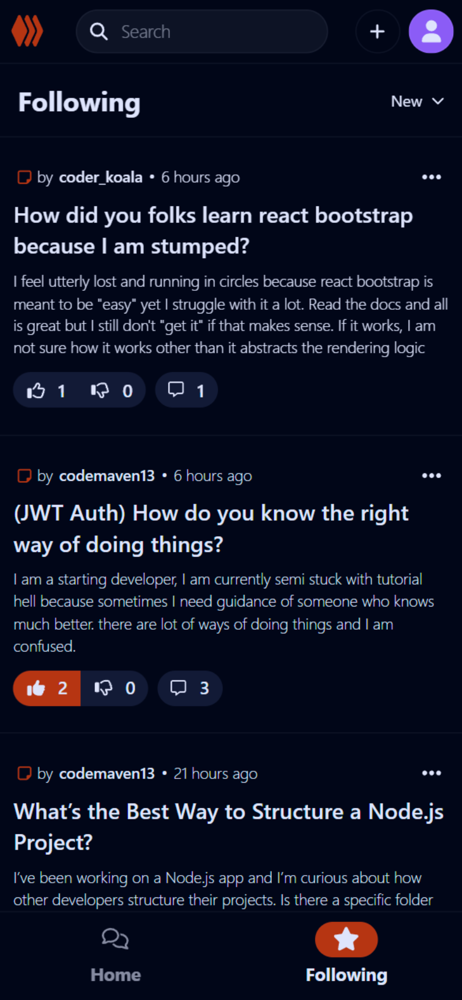
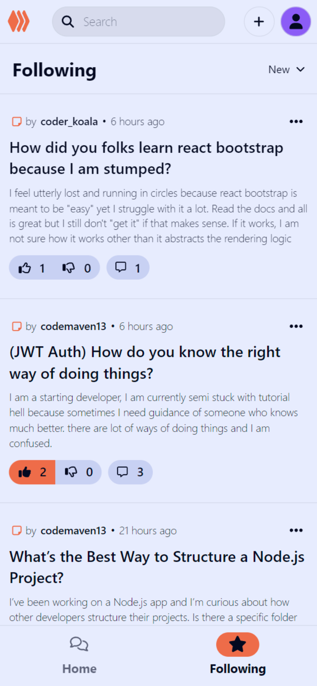
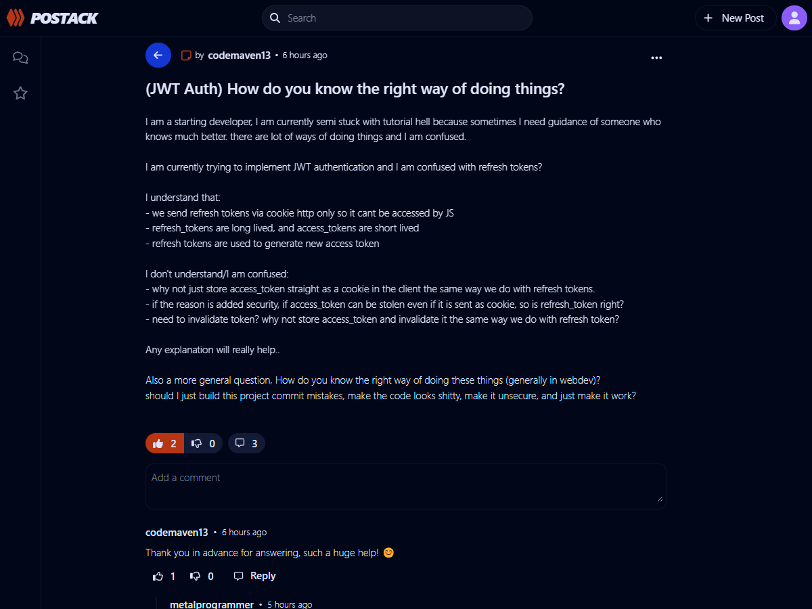
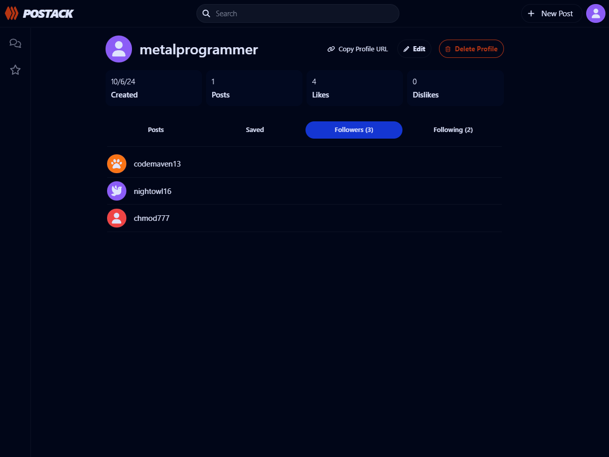
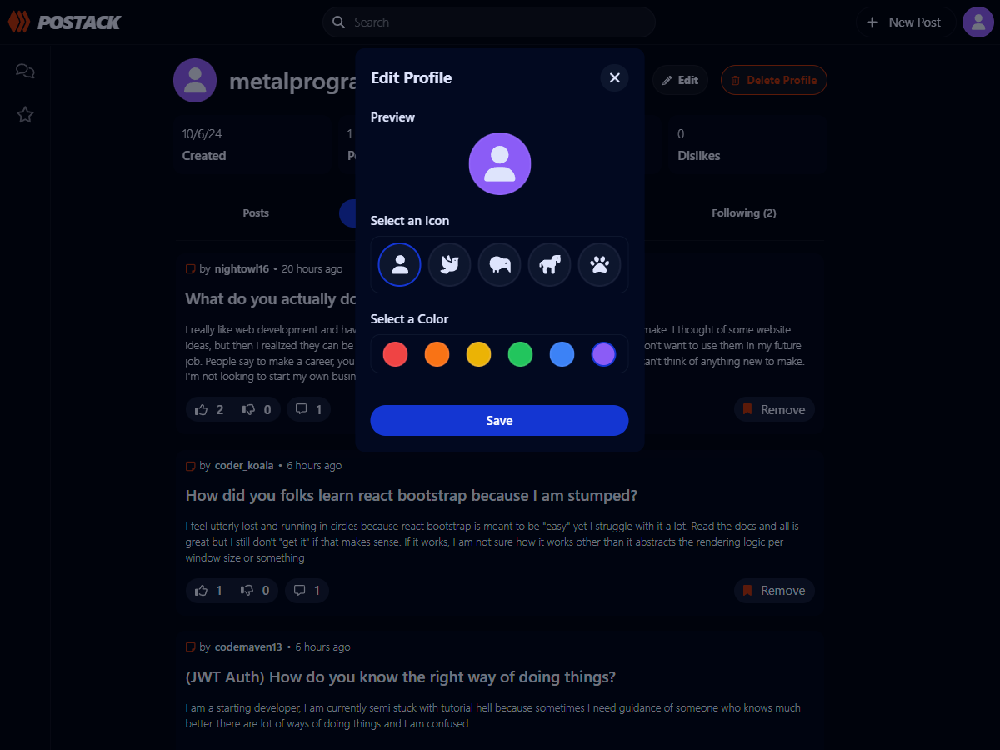

# Postack

**Postack** is a forum application built on the MERN stack, drawing inspiration from various social media platforms, with Reddit as its primary influence. Leveraging MongoDB for data storage, Express and Node.js for the backend, and React for a seamless user experience, it allows users to share posts, comment, and reply in structured, thread-based discussions.

## Table of Contents

-   [Features](#features)
    -   [User Management](#user-management)
    -   [Content Interaction](#content-interaction)
    -   [Post Management](#post-management)
    -   [Additional Features](#additional-features)
-   [Installation for Local Development](#installation-for-local-development)
-   [Usage](#usage)
-   [Technologies](#technologies)
    -   [Frontend](#frontend)
    -   [Backend](#backend)
-   [Database Schema Structure](#database-schema-structure)
-   [Screenshots](#screenshots)
    -   [Home](#home)
    -   [Following (Mobile)](#following-mobile)
    -   [Post](#post)
    -   [Profile](#profile)
    -   [Profile Customization](#profile-customization)

## Features

### User Management

-   User Authentication: Secure sign up and log in functionality.
-   Profile Customization: Personalize user profiles with custom avatars and themes.
-   Follow Users: Stay updated by following other users.

### Content Interaction

-   Create Posts: Users can create posts, which others can interact with by:
    -   Liking and Disliking posts.
    -   Commenting on posts.
    -   Replying to comments.
-   Search Posts: Users can search for specific posts to quickly find content of interest.
-   Delete Posts, Comments, and Replies: Users can delete their own posts, comments, and replies.

### Post Management

-   Save Posts: Users can save posts to their profile for easy access later.

### Additional Features

-   Dark Mode: Supports a dark theme for better viewing comfort.

## Installation for Local Development

If you'd like to run the application locally, follow the steps below. **Note:** You will need to configure certain settings (such as environment variables, authentication, and HTTPS) to make the app work properly in your local environment.

### Steps:

1. Clone the repository: `git clone https://github.com/username/postack.git`
2. Navigate to the project directory: `cd postack`
3. Install dependencies: `npm install`
4. Set up necessary environment variables and configurations for your local environment.
5. Run the frontend and backend locally:
    - Frontend: `cd frontend && npm run dev`
    - Backend: `cd backend && npm run dev`
6. Access the app in your browser at `http://localhost:5173/`

## Usage

1. Create an account or log in.
2. Create a new post or join an existing post discussion.
3. Like, dislike, comment, or reply on comments in posts.

## Technologies

### Frontend

-   React (including React DOM, React Router DOM)
-   Axios
-   Font Awesome
-   Moment.js
-   Vite
-   Tailwind CSS

### Backend

-   Express
-   Mongoose
-   Passport (with Passport Local)
-   Connect-Mongo
-   CORS
-   Express Async Handler
-   Express Session

## Database Schema Structure

The database schema for **Postack**, built on MongoDB, is designed to support a seamless user experience within the forum application. It consists of the following key components:

-   **Users**: This table stores user information, including unique usernames, authentication data, and user preferences, such as profile customization and dark mode settings. Each user can follow and be followed by others.

-   **Forum Posts**: This table holds the essential content of the application. Each post includes a title, content, and the author's username. Users can like or dislike posts, and timestamps track when each post was created and updated.

-   **Comments**: Each forum post can have multiple comments, allowing users to engage in discussions. Comments are associated with specific posts and include the content, author, and interaction data (likes and dislikes).

-   **Replies**: The replies table allows users to respond to comments, encouraging detailed discussions. Each reply is linked to its parent comment, maintaining the context of discussions.

## Screenshots

### Home

_Dark Mode_

_Light Mode_

### Following (Mobile)

<table>
    <tr>
        <td><i>Dark Mode</i></td>
        <td><i>Light Mode</i></td>
    </tr>
    <tr>
        <td></td>
        <td></td>
    </tr>
</table>

### Post

### Profile

### Profile Customization

